# 🤠 Cowboy Poker

> **서부 시대 술집에서 펼쳐지는 텍사스 홀덤과 1:1 권총 결투의 만남**

---

## 👋 소개

- **Cowboy Poker**는 서부 시대 술집을 배경으로, 카우보이들이 모여 **텍사스 홀덤 포커**를 즐기다가 시비가 붙으면 **술집 밖으로 나가 1:1 권총 결투**를 벌이는 멀티플레이 게임입니다.
- 포커 테이블에서 칩을 잃거나 상대를 도발하면, 포커 판이 그대로 **3D 슈팅 배틀 씬**으로 이어지며 **패배자는 계정이 삭제되고 보유한 돈 전부를 승자에게 빼앗깁니다.** 한 방에 모든 걸 걸어야 하는 **하이리스크 콘셉트**가 핵심 재미 요소입니다.
- 신뢰성이 중요한 **로그인·포커 베팅·결과 정산**은 **Node.js TCP 서버**가, 실시간 위치 동기화·발사·피격 같은 **저지연 결투 흐름**은 **C++ UDP 서버**가 분담하여 처리합니다.

---

## ✨ 게임 주소

### **호스트 주소** : `3.36.159.29`

### **포트 번호**
- **TCP 9000** : 로그인 / 포커 게임 (Node.js 서버)
- **UDP 7777** : 로비 / 1:1 결투 동기화 (C++ 서버)

### **게임 다운로드**

- **[Cowboy-Poker.zip (Google Drive)](https://drive.google.com/file/d/1z7wfaax3R4iI4KOXsb4uiNbRG74qOQ4O/view?usp=drive_link)** — Windows 클라이언트 빌드
- **[Cowboy-Poker-Mac.zip (Google Drive)](https://drive.google.com/file/d/1229p3k6aeIJlDwz61SIovLmufxIVqIZt/view?usp=drive_link)** — macOS 클라이언트 빌드

### **접속 방법**
1. 위 링크에서 OS에 맞는 클라이언트(`Cowboy-Poker.zip` / `Cowboy-Poker-Mac.zip`)를 다운로드해 압축을 풀고 실행합니다.
2. 로그인 화면에서 **호스트 주소** `3.36.159.29`와 **포트** `9000`을 입력합니다.
3. 아이디·비밀번호를 입력해 접속합니다.

> UDP 로비/결투(`7777`)는 TCP 로그인 성공 후 클라이언트가 자동으로 연결합니다.

---

## 🎯 슈팅 결투 — 조작 & Hit 판정

결투 씬의 핵심 메커니즘입니다. 포커에서 배틀로 넘어가기 전에 미리 읽어 두면 플레이 이해에 도움이 됩니다.

### 조작

| 입력 | 동작 |
|------|------|
| **WASD** | 이동 |
| **Space** | 점프 |
| **마우스** | 시점 조작 |
| **우클릭** | 조준 |
| **좌클릭** | 사격 |
| **R** | 재장전 |

### Hit 판정

- 총기마다 **조준점(크로스헤어) 크기**가 다릅니다. (무기 등급 LV1 / LV2에 따라 조준점 크기도 달라집니다.)
- **이동 속도에 비례**해 조준점이 커지거나 작아집니다. **멈춰 있을 때** 조준점이 가장 작습니다.
- 실제 탄착은 조준점 **영역 안의 랜덤 위치**에 발생합니다. 조준점 중심만 맞춘다고 항상 명중하지는 않습니다.
- 탄착 부위(머리 / 몸통 / 팔다리)에 따라 데미지가 달라지며, 서버가 HP를 차감합니다.

---

## 👩‍💻 팀원

<table>
  <tr>
    <td align="center">
      <a href="https://github.com/znfnfns0365">
        
        <br /><sub><b>김동헌</b></sub>
        <br /><sub>팀장</sub>
        <br /><sub>서버 · 인프라 개발</sub>
      </a>
    </td>
    <td align="center">
      <a href="https://www.anthropic.com/claude/sonnet">
        
        <br /><sub><b>Claude Sonnet 4.6</b></sub>
        <br /><sub>클라이언트 개발</sub>
        <br /><sub>어시스턴트</sub>
      </a>
    </td>
  </tr>
</table>

---

## ⚙️ 기술 스택

### Client


| 분류 | 기술 |
|------|------|
| 게임 엔진 | **Unity** (C#) |
| 네트워크 | TCP / UDP 듀얼 채널 |
| 직렬화 | Protocol Buffers (TCP) + Raw Binary (UDP) |

> Unity 클라이언트는 **Claude Sonnet 4.6**이 작성한 코드로 전체 구성되어 있습니다.  
> 유료 Unity 에셋 사용 문제로 비공개 저장소로 운영됩니다.

### Backend — Node.js (TCP, 포커)


| 분류 | 기술 |
|------|------|
| 런타임 | **Node.js ≥ 20** (ES Module) |
| 패키지 매니저 | **Yarn** |
| 네트워크 | TCP (`net` 모듈) |
| 직렬화 | **Protocol Buffers** (`protobufjs`) |
| DB | **PostgreSQL** (`pg`) |
| 캐시 | **Redis** (`redis`) |
| 인증 | `bcrypt` |
| 개발 | `nodemon`, `dotenv` |

### Backend — C++ (UDP, 로비/결투)


| 분류 | 기술 |
|------|------|
| 언어 | **C++17** (Visual Studio 2022, `v143`) |
| 플랫폼 | Windows 10+ |
| 네트워크 I/O | Windows **IOCP** (I/O Completion Port) |
| 소켓 | **UDP** (`WSARecvFrom` / `WSASendTo` 비동기) |
| In-memory DB | **Redis** (`hiredis`, vcpkg) |
| 직렬화 | Raw Binary (`BufferReader` / `BufferWriter`) |

### Infrastructure


| 분류 | 기술 |
|------|------|
| 배포 환경 | **AWS EC2** (Microsoft Windows Server 2022 Core Base) |
| 데이터베이스 | **AWS RDS** (PostgreSQL) |
| 캐시 | Redis |

### Tools


| 분류 | 기술 |
|------|------|
| AI 코드 어시스턴트 | **Cursor** |
| IDE | **Visual Studio 2022** |
| 에디터 연동 | **Cursor MCP** (Model Context Protocol — Unity 연동) |
| 버전 관리 | Git, GitHub |
| 개발 | **Nodemon** |
| 패킷 디버깅 | Unity 클라이언트 · 서버 로그 직접 검증 |

---

## 🗂️ 저장소 구성

| 저장소 | 역할 | 언어 |
|--------|------|------|
| [`cowboy-poker-server-node`](https://github.com/Cowboy-Poker/cowboy-poker-server-node) | 로그인 · 회원가입 · 포커 게임 · 베팅 · 정산 (TCP) | Node.js |
| [`cowboy-poker-server-cpp`](https://github.com/Cowboy-Poker/cowboy-poker-server-cpp) | 로비 동기화 · 1:1 권총 결투 (UDP) | C++17 |
| [`cowboy-poker-protocols`](https://github.com/Cowboy-Poker/cowboy-poker-protocols) | `.proto` 파일 · packetTypes (Node.js / C++ / C# 공유) | Protobuf |
| [`cowboy-poker-client-unity`](https://github.com/Cowboy-Poker/cowboy-poker-client-cs) | Unity 게임 클라이언트 (비공개) | C# |

---

## 📃 전체 아키텍처

```
                         ┌────────────────────────┐
                         │   Unity 클라이언트     │
                         │   (Windows / C#)       │
                         └─────────┬──────────────┘
                                   │
                ┌──────────────────┼──────────────────┐
                │                                     │
        TCP :9000 (Protobuf)                  UDP :7777 (Raw Binary)
                │                                     │
                ▼                                     ▼
      ┌───────────────────┐                 ┌──────────────────┐
      │   Node.js Server  │                 │   C++ Server     │
      │  - 로그인/회원가입│                 │  - 로비 이동     │
      │  - 포커 방·베팅   │                 │  - 1:1 결투      │
      │  - 게임 결과 정산 │                 │  - 발사/피격     │
      └────┬─────────┬────┘                 └────────┬─────────┘
           │         │                               │
           ▼         ▼                               ▼
     ┌─────────┐ ┌────────┐                    ┌────────┐
     │PostgreSQL│ │ Redis  │ ◄──────공유──────► │ Redis  │
     │(영구저장)│ │(세션)  │                    │(상태)  │
     └─────────┘ └────────┘                    └────────┘
                  AWS RDS                       AWS EC2
              (Win Server 2022 Core)
```

---

## 📃 ERD Diagram

| 테이블 | 주요 컬럼 |
|--------|-----------|
| `users` | `user_no`, `user_id`, `password`, `nickname`, `hp`, `balance`, `char_type`, `pos_x/y/z`, `rot`, `scene` |
| `inventories` | `user_no`(FK), `weapon_type`, `ammo_type`, `ammo_count` |
| `poker_stats` | `user_no`(FK), `wins`, `total_games` |

### Redis 키 스키마

```
user:{userId}  (Hash)
  nickname, scene, hp, balance, char_type
  pos_x, pos_y, pos_z, rot
  weapon, ammo_type, ammo
```

---

## 📃 패킷 구조

### TCP 패킷 (Node.js 서버 — 6바이트 헤더)

```
┌──────────────────┬───────────────┬────────────────────────┐
│  totalLength (4B)│ packetType(2B)│  payload (protobuf)    │
└──────────────────┴───────────────┴────────────────────────┘
```

### UDP 패킷 (C++ 서버 — 14바이트 헤더)

```
┌──────────────┬─────────────┬──────────────┬───────────────┐
│ sessionId(8B)│ sequence(4B)│ packetId(2B) │ payload(raw)  │
└──────────────┴─────────────┴──────────────┴───────────────┘
```

### 패킷 ID 범위

| 범위 | 용도 | 프로토콜 | 직렬화 |
|------|------|----------|--------|
| `100 ~ 103` | 로그인 / 회원가입 | TCP | Protobuf |
| `200 ~ 223` | 포커 (방 · 게임 · 배틀 매칭) | TCP | Protobuf |
| `300 ~ 361` | 로비 / 결투 동기화 | UDP | Raw Binary |

---

## ⚽ 프로젝트 주요 기능

1. **회원가입 / 로그인**

<p align="center">
  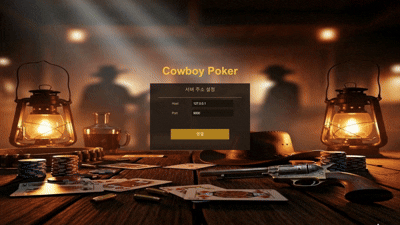
</p>

   - 클라이언트에서 아이디·비밀번호·닉네임을 입력해 회원가입을 진행합니다.
   - 비밀번호는 `bcrypt`로 해시되어 PostgreSQL에 저장됩니다.
   - 로그인 성공 시 마지막 접속 상태(씬, HP, 위치, 무기, 잔액 등)를 Redis에서 복원해 클라이언트에 한 번에 내려줍니다.

<br>

2. **로비 → 살롱 이동**

<p align="center">
  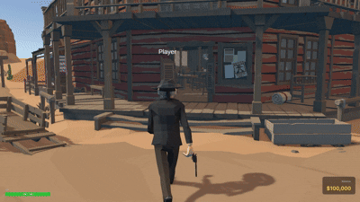
</p>

   - 마을 로비에서 살롱(술집) 내부로 이동합니다.
   - 살롱 입장 시 `C_UDP_HELLO`로 핸드셰이크 후 sessionId가 발급됩니다.
   - 로비 내 이동은 `C_LOBBY_MOVE`로 좌표를 서버에 전송하고, 서버는 동일 로비의 다른 유저들에게 `S_LOBBY_PLAYER_MOVE`를 브로드캐스트합니다.
   - 10초 동안 하트비트가 없으면 자동 퇴장 처리(`S_LOBBY_PLAYER_LEAVE`)됩니다.

<br>

3. **포커 방 입장 / 생성**

<p align="center">
  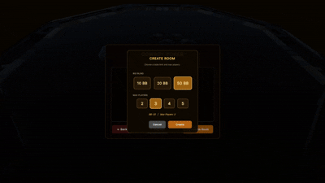
</p>

   - 술집 로비에서 포커 테이블에 앉으면 `C_GetRoomList`로 현재 방 목록을 받아옵니다.
   - 방 이름, 최대 인원(최대 5명), 빅 블라인드 금액을 설정해 새 방을 만들 수 있습니다.
   - 진행 중인 게임에 입장하면 다음 핸드부터 자동 합류됩니다.

<br>

4. **텍사스 홀덤 포커 진행**

<p align="center">
  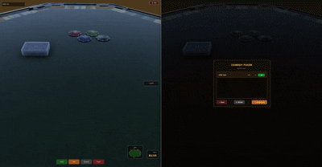
</p>

   - 2명 이상 모이면 게임이 자동으로 시작되며, 서버가 덱 셔플 → 홀카드 2장 딜 → SB/BB 블라인드 → UTG 베팅 순으로 진행합니다.
   - PRE_FLOP → FLOP → TURN → RIVER → SHOWDOWN 5단계 페이즈를 따라 베팅 라운드가 진행됩니다.
   - 5가지 베팅 액션(FOLD / CHECK / CALL / RAISE / ALL_IN)을 지원하며, 서버가 가능한 액션을 매 턴 계산해 클라이언트에 알려줍니다.

   **4인 포커 — 올인 후 잔액 $0**

   - 4명이 한 테이블에서 동시에 플레이하는 장면입니다.
   - 한 플레이어가 **올인(ALL_IN)** 을 선택해 보유 칩을 전부 팟에 넣은 뒤, 핸드 결과에 따라 **잔액이 $0** 이 된 상황을 보여줍니다.
   - 칩을 모두 잃으면 방에서 퇴출됩니다.

<p align="center">
  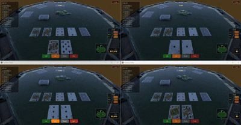
</p>

<br>

5. **쇼다운 및 결과 정산**

<p align="center">
  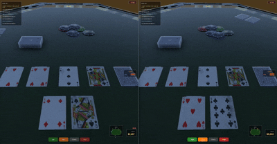
</p>

   - 한 명만 남거나 RIVER가 끝나면 7장 중 최고 5장으로 핸드 평가가 이루어집니다.
   - 승자에게 팟 전액이 지급되고, 잔액 변동이 있는 플레이어들의 잔액이 Redis에 갱신됩니다.
   - 패배자들(FOLD 제외)에게는 승자의 패가 보여집니다.
   - 결과 발표 후 10초 대기 시간이 지나면 다음 핸드가 자동으로 시작됩니다.

<br>

6. **포커 → 1:1 권총 결투 연계**

<p align="center">
  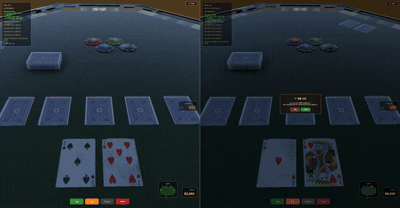
</p>

   - 포커 진행 중 같은 방의 플레이어에게 `C_BattleRequest`를 보내 결투를 신청할 수 있습니다.
   - 양측 모두 수락하면 자동 폴드 처리 후 핸드가 종료되고, 두 플레이어는 슈팅 씬으로 이동합니다.
   - 결투 씬에서는 C++ UDP 서버가 위치·발사·피격을 실시간으로 동기화합니다.

<br>

7. **무기 상점 시스템**

<p align="center">
  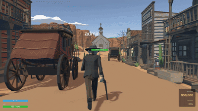
</p>

   - 로비의 NPC에서 5종 무기(Rifle, Shotgun ×2, Revolver ×2)를 구매할 수 있습니다.
   - 가격대별로 라이플($10,000), 샷건($300/$3,000), 리볼버($500/$5,000)가 있으며, 잔액 검증 후 인벤토리에 반영됩니다.
   - 총기 종류마다 다른 **반동(Recoil)** 이 구현되어 있어, 라이플·샷건·리볼버별 사격감이 구분됩니다.
   - 착용한 무기에 따라 **이동 속도**도 달라져, 총기 종류·등급별로 전투 기동감이 다릅니다.
   - 구매한 무기에는 탄흔(스카) 디테일이 적용됩니다.

<p align="center">
  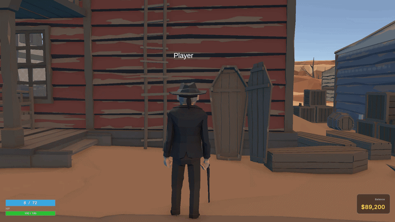
</p>

<br>

8. **3D 슈팅 결투 (Duel)**

<p align="center">
  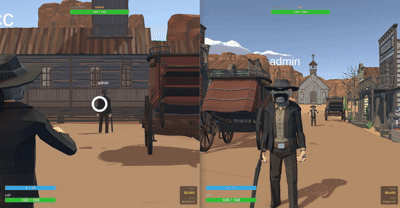
</p>

   - 조작·Hit 판정은 문서 상단 **🎯 슈팅 결투 — 조작 & Hit 판정** 섹션을 참고하세요.
   - 화면 **가운데 상단**에 상대 플레이어 **HP UI**가 표시됩니다.
   - 상대를 맞히면 **Hit!** 표시가 뜹니다.
   - 피격 시 화면이 **잠깐 빨갛게** 변하면서 **잃은 HP량**이 표시됩니다.
   - 패배자(`C_USER_LOSE`)의 잔액 전액이 승자에게 이전되고 계정이 삭제되며, 승자 플레이어는 자동으로 로비로 복귀합니다.

<br>

9. **호텔 휴식 시스템**

<p align="center">
  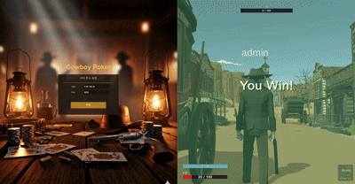
</p>

   - 결투에서 입은 부상은 자동으로 회복되지 않습니다.
   - 호텔에서 `$1,000`을 지불하면 HP를 100으로 회복할 수 있습니다.

<br>

10. **연결 끊김 / 재접속 복원**
    - 게임 중 소켓이 끊기면 자동으로 폴드 처리됩니다.
    - Redis 세션은 30초 유예 시간을 두고, 그 안에 재접속하면 마지막 상태(씬·위치·잔액·HP·무기)가 그대로 복원됩니다.
    - 30초가 지나면 DB에 영구 저장된 후 세션이 정리됩니다.

---

## 🚀 서버 기술 구현

### 1. Node.js 서버 — 신뢰성 중심 TCP

- **Protocol Buffers 기반 패킷 통신**: 클라이언트·서버가 동일한 `.proto` 정의를 공유해 스키마 불일치를 방지합니다.
- **6바이트 헤더 + 페이로드 구조**: `recvBuffer`에 누적된 바이트에서 `totalLength` 검증 후 패킷을 추출하여 부분 수신/병합 수신 모두 안전하게 처리합니다.
- **PostgreSQL + Redis 이중화**: 계정·인벤토리는 PostgreSQL(AWS RDS)에 영구 저장, 게임 세션·잔액은 Redis 캐시에 두어 응답 속도를 확보합니다.
- **방·게임 도메인 모델 분리**: `Room` 클래스가 슬롯/베팅/페이즈 상태를 캡슐화하여 핸들러는 의도만 호출하고 상태 변경은 단일 진입점에서 이루어지도록 했습니다.
- **포커 핸드 평가**: 7장 카드 중 가능한 5장 조합을 평가해 최고 핸드 랭크를 산출하는 로직을 자체 구현했습니다.

### 2. C++ 서버 — 저지연 중심 UDP

- **Windows IOCP**: `WSARecvFrom` 비동기 수신을 IOCP에 등록해 polling 없이 커널 레벨로 I/O 완료 이벤트를 처리합니다.
- **Raw Binary 직렬화**: Protobuf 파싱 오버헤드 없이 `BufferReader`/`BufferWriter`로 little-endian 바이너리를 직접 다룹니다.
- **`#pragma pack(1)` 패킷 헤더**: 14바이트 고정 헤더로 padding 없이 메모리·대역폭을 절약합니다.
- **중복 패킷 필터**: `sequence` 번호로 UDP 특성상 발생하는 중복 수신 패킷을 즉시 drop합니다.
- **배틀 격리 broadcast**: 결투 중인 세션은 로비 broadcast에서 제외하고, 결투 패킷은 매칭된 상대에게만 전달합니다.

### 3. 메모리 최적화 (C++)

- **Custom STL Allocator**: `Vector`/`List`/`Map`/`HashMap`/`Queue` 등 모든 STL 컨테이너에 custom allocator를 적용해 heap 할당 경로를 단일화했습니다.
- **`xnew` / `xdelete` (Placement New)**: 메모리 획득과 객체 초기화를 분리해 추후 memory pool로 손쉽게 교체할 수 있는 단일 진입점을 확보했습니다.
- **Intrusive Reference Counting**: `std::shared_ptr`의 control block heap 할당을 제거하기 위해 `RefCountable`이 `atomic<int32>` ref count를 객체 내부에 내장합니다.
- **`StompAllocator`**: debug 빌드에서 `VirtualAlloc`으로 page 경계에 데이터를 정렬해 buffer overrun을 즉시 access violation으로 검출합니다.
- **Thread Local Storage**: `LThreadId`, `LLockStack`을 `thread_local`로 선언해 thread별 상태를 lock 없이 접근하고, lock profiler로 deadlock 순환을 감지합니다.

### 4. 프로토콜 공유 전략

- 세 가지 언어(`PacketTypes.cs` / `packetTypes.h` / `packetTypes.js`)에서 동일한 패킷 ID를 공유합니다.
- `Protocols/` 디렉터리는 **Git 서브모듈**로 관리되어 Node.js·C++·Unity가 동일한 `.proto` 스펙을 단일 소스로 참조합니다.
- 패킷 ID 변경 시 세 파일을 모두 동시에 업데이트하는 정책으로 스키마 드리프트를 방지합니다.

### 5. 인프라

- **AWS EC2 (Microsoft Windows Server 2022 Core Base)** 단일 인스턴스에서 Node.js 서버와 C++ 서버를 함께 운영합니다.
- **AWS RDS PostgreSQL**을 영구 저장소로 사용하여 EC2가 재기동되어도 계정·전적 데이터가 유지됩니다.
- **Redis**를 같은 호스트에 두어 두 서버가 동일한 유저 상태(`user:{userId}`)를 공유하도록 했습니다.

---

## 🚀 추가 구현 기능

1. **포커 룸 자동 게임 시작**
   - 방장이 별도로 시작 버튼을 누르지 않아도, 2명 이상 입장하면 일정 시간 후 자동으로 핸드가 시작됩니다.
   - 게임 종료 후 10초 카운트다운이 끝나면 다음 핸드가 자동 진행되어 끊김 없는 플레이가 가능합니다.

2. **부위별 데미지 시스템**
   - 결투 시 머리(150/120/30) / 몸통(60/40/10) / 팔다리(30/20/5) 데미지가 무기별로 다르게 적용됩니다.
   - 샷건은 발사체 10개가 동시에 나가 부위·거리에 따라 누적 데미지가 결정됩니다.

3. **무기 등급 시스템**
   - 같은 종류의 무기도 LV1 / LV2로 구분되어 가격에 따라 외형 차이가 있습니다.
   - 등급별 **조준점(크로스헤어) 크기**가 달라, LV2일수록 조준점이 작아 정밀 사격에 유리합니다.

4. **세션 끊김 30초 유예**
   - 갑작스러운 네트워크 단절에도 마지막 상태가 Redis에 보존되어, 30초 안에 다시 접속하면 위치·잔액·게임 진행 상태가 그대로 복원됩니다.

5. **포커 ↔ 결투 양방향 흐름**
   - 결투에서 패배해 잔액이 0이 되어도 다시 포커 방에 들어가 새로 게임을 시작할 수 있습니다.
   - 결투에서 이긴 돈으로 다시 더 큰 빅 블라인드 방에 도전할 수 있는 게임 사이클이 형성됩니다.

6. **닉네임·HP·잔액 실시간 표시**
   - `S_PLAYER_INFO`로 본인의 전체 상태가, `S_BATTLE_OPPONENT_PLAYER_INFO`로 결투 상대 정보가 별도 패킷으로 전달됩니다.
   - 클라이언트가 별도 폴링 없이 서버 푸시로 정보를 업데이트합니다.

---

## 📌 TODO — 추후 구현 예정

### 🛠️ 인프라 / 운영

- [ ] **쿠버네티스 컨테이너 가상화**
  - 현재 단일 EC2 인스턴스에서 운영 중이라 서버가 다운되면 전체 서비스 중단으로 이어짐
  - K8s 기반 컨테이너 오케스트레이션으로 자동 복구(Self-Healing) 및 무중단 배포(Rolling Update) 도입
  - 트래픽 증가 시 HPA(Horizontal Pod Autoscaler)로 자동 스케일 아웃
- [ ] **Redis Pub/Sub 기반 수평 확장** — 서버 인스턴스 다중화 시 방·세션 상태 동기화
- [ ] **로드 밸런서 + 다중 인스턴스** — NGINX 또는 AWS ALB로 라운드 로빈 분산
- [ ] **Linux 서버 지원** — 현재 Windows 전용인 C++ UDP 서버를 Linux 환경에서도 실행·배포할 수 있도록 포팅

### 🤖 AI 시스템

- [ ] **AI 플레이어 도입**
  - 사람이 부족한 시간대에도 포커 방이 비지 않도록 NPC 봇 입장
  - 난이도별 베팅 패턴(공격형 / 수비형 / 블러프) 구현
  - 결투 씬에서도 AI와 대결 가능하도록 확장
  - AI 판단·추론은 **클라우드**에서 처리해 게임 서버(EC2) 부하와 분리
- [ ] **AI 행동 패턴 학습** — 상위 랭커들의 베팅 로그를 클라우드에서 학습해 더 자연스러운 플레이 구현

### 🎮 콘텐츠 추가

- [ ] **랭킹 시스템**
  - 누적 승리 횟수, 최대 잔액, 결투 승률을 기준으로 한 시즌 랭킹
  - 일간 / 주간 / 시즌 리더보드 UI 추가
- [ ] **현상금 이벤트**
  - 특정 유저의 머리에 현상금을 걸어 결투에서 처치 시 추가 보상 지급
  - 운영자가 자동으로 일정 시간마다 랜덤 유저에게 현상금을 부여하는 시스템
- [ ] **상대 플레이어 전적 / 잔액 확인**
  - 포커 진행 중 같은 방 플레이어의 누적 승률 · 결투 전적 · 보유 잔액을 조회하는 패널 제공
  - 상대를 분석해 베팅 전략을 세울 수 있도록 정보전 요소 추가
- [ ] **돈 보관 / 캐릭터 간 이체 시스템**
  - 같은 사용자 계정 내에서 다른 캐릭터(부캐)에게 돈을 옮길 수 있는 금고 시스템
  - 결투에서 빼앗기지 않도록 일부 자금을 안전 보관소에 예치 가능
- [ ] **캐릭터 외관 교체**
  - 카우보이 / 카우걸 / 무법자 등 다양한 스킨 제공
  - 모자, 망토, 부츠 등 부위별 외형 커스터마이징
- [ ] **아이템 상점 확장**
  - 무기 외에 회복 아이템, 버프 아이템(이동 속도 증가, 결투 데미지 감소 등)
- [ ] **총알 강화 시스템**
  - **독 총알** — 도트 데미지로 일정 시간 동안 지속 피해
  - **은 총알** — 기본 데미지 강화 (헤드샷 즉사 가능)
  - 무기 등급(LV1/LV2)과 별개로 탄환 종류로 데미지 커브를 다변화
- [ ] **배틀 관전 및 배팅 시스템**
  - 진행 중인 결투를 같은 방의 다른 포커 플레이어가 실시간으로 관전 가능
  - 관전 중 둘 중 한 명에게 자신의 잔액을 배팅하면 승자 측 베터들이 분배 보상 획득
  - 관전자 입장/퇴장 패킷, 슈팅 씬 상태 브로드캐스트, 관전 가능 배틀 목록 UI 추가

### ⚡ 성능 개선

- [ ] **Worker Threads 도입 (Node.js)** — 핸드 평가 등 무거운 연산을 별도 스레드로 분리
- [ ] **C++ 멀티스레드 전환** — 수신 전용 thread + worker N개 + Socket sharding
- [ ] **Redis Connection Pool (C++)** — 현재 단일 연결 → worker thread 수만큼 풀 구성
- [ ] **비동기 Redis (hiredis-async)** — Redis I/O 블로킹 제거

### 🔒 보안 / 신뢰성

- [ ] **패킷 검증 강화** — damage 값 등을 서버 권위로 재계산해 클라이언트 입력 신뢰 최소화
- [ ] **암호화 / Anti-Spoofing** — sessionId 서명, 발신 IP 검증
- [ ] **중요 패킷 ACK 재전송** — 결투 시작 · 종료 · 정산 등 손실되면 안 되는 이벤트 보강
- [ ] **게임 로직 유닛 테스트** — `handEvaluator`, `deck`, `betActionHandler` 자동화 테스트 구축

---

## 📅 버전

**버전**: 0.1.0 (Pre-Alpha)
**최종 업데이트**: 2026-05-25

---

> 🤠 *"In this saloon, your chips are your life — and your gun is your last resort."*
